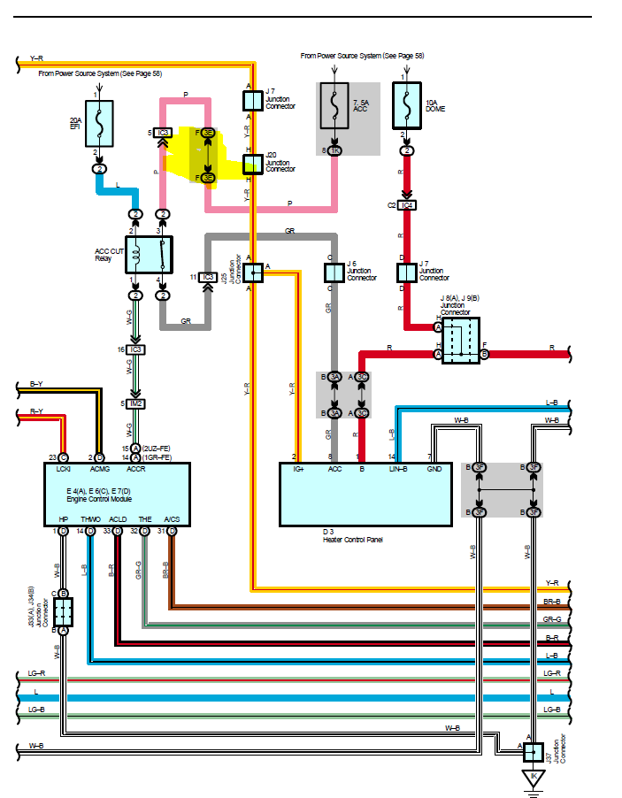
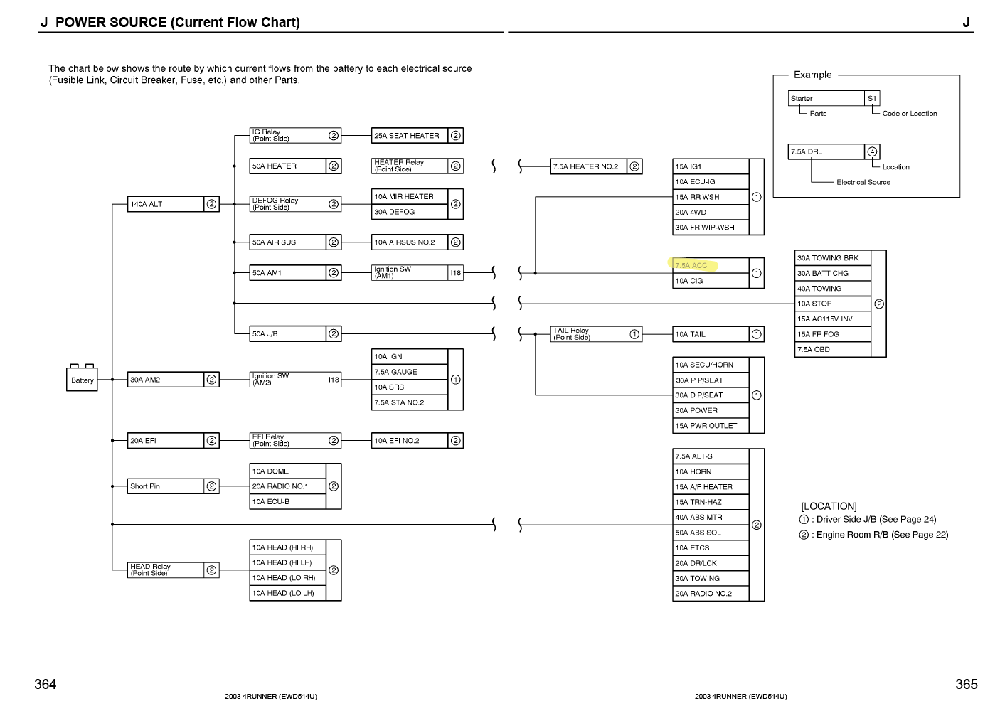

# Installing a Garmin Mini 2 Dashcam on 4th Gen 4runner

## Dashcam
I chose the Garmin Mini 2 mainly for it's size. I've used Garmin's other hardware and have been impressed. The price is also attractive. 

I purchased two units and placed one rear-facing. Garmin's Drive App supports this and does a good job synchronizing the feeds and timing.

## Wiring
I ran wiring from the main driver's kick panel junction box up the A Pillar and across the headliner.  
I put a 12/24VDC to USB A adapter in the headliner above the map light unit. 

I tapped the `pink` wire at the drivers' junction box (J/B in Toyota literature), which is fed from the `Accessory` fuse and is on only when the car is in `ACC` or `RUN`.  

Note: there seems to be a lockout relay that load sheds `Accessory` when the engine is in `START`. I assume this is to allow all current to go to the starter. 

I used Ancor 16/2 tinned wire, to allow for higher load uses in future. 

I then ran an additional wire from the Map Light console, along the driver's side upper conduit then across the rear window frame to the rear dome light. 

## Hardware mounting
The front dashcam mounted just fine with Garmin's adhesive mount. The rear was trickier.

I used magnets (random Amazon circular magnets) both under the headliner and attached to the [Garmin magnetic mount](https://www.garmin.com/en-US/p/567473). This allows some level of flexibility while also avoiding drilling holes in the headliner.  

I routed the cord around the dome light hole and it fits well enough. 

## SD Cards
I used 1x Samsung PRO Endurance 256GB and 1x Sandisk High Endurance 256GB cards.  
The Mini 2 cameras only support FAT32 partitions and **will not** re-partition a card that has NTFS or exFAT partitions on it, but will format it once it has the correct partitions.  
I had always though FAT32 did not support partitions larger than 32GB, but it turns out that's not the case. **Windows can't format a FAT32 partition larger than 32GB**, but it will happily read them.  
To make a card work I had to:
- Insert card into computer and format it with Windows to a single FAT32 partition of 32GB
- Put the card back into the camera and hold the side button to trigger a reformat
- Reboot the camera
- Now when reading the card in Windows, all 256GB will be available
